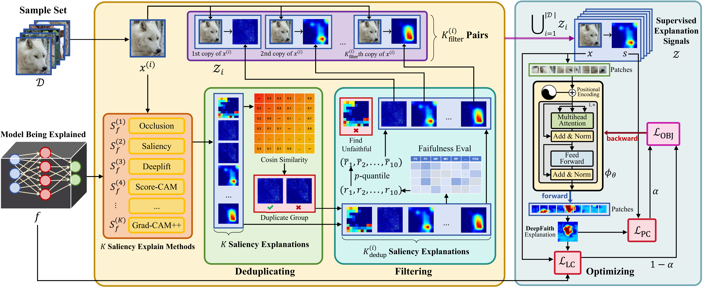
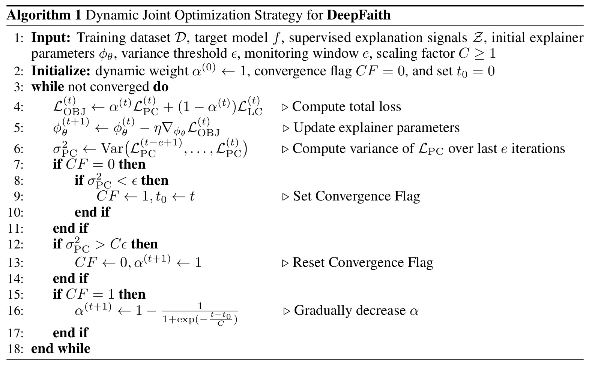

<br />
<p align="center">
  <a href=" ">
     
  </a>

  <h1 align="center">Learning for Highly Faithful Explainability</h1>

  <p align="center">
      <a href="https://www.python.org/"></a>
    <a href="https://pytorch.org/get-started/locally/"></a>
    <a href="https://pytorchlightning.ai/"></a>
    <a href="https://black.readthedocs.io/en/stable"></a>
    <br>
    <br />
  </p>
</p>

This repository contains the official implementation of **DeepFaith** (Deep architecture-based Faithful amortized explainer), a systematical solution for highly faithful explainability in the **Learning to Explain** paradigm, proposed in the paper *"Learning for Highly Faithful Explainability"* (under review at ICLR 2026).  


## Introduction
The **Learning to Explain** paradigm aims at training a dedicated neural explainer to generate high-quality explanations via a single forward pass at inference, shifting computational burden to the training phase (amortized explanation).  

However, existing approaches in this paradigm face three core challenges:  
1. **Assumption Dependence**: Self-supervised optimization methods rely on restrictive assumptions about the target model (e.g., feature separability) or task, limiting generalizability.  
2. **Low-Quality Supervision**: Methods driven by prior XAI explanations struggle to guarantee the quality of supervisory signals, as existing XAI tools often produce noisy or inconsistent results.  
3. **Trade-offs Between Convergence and Quality**: Relying solely on self-supervision leads to poor convergence, while relying solely on prior explanations caps performance at the quality of the imitated XAI methods.  

DeepFaith addresses these challenges by centering **explanation faithfulness** (a quantitative measure of how well explanations reflect a model’s true decision-making process) in its design—unifying theoretical rigor, high-quality supervision, and dynamic optimization to generate more reliable explanations across modalities.  

<br>
<p align="center">
     <br>
</p>

## Getting Started

### Installation

**DeepFaith** is built upon the open-source project [*latec*](https://github.com/IML-DKFZ/latec). Once *latec* is successfully deployed, **DeepFaith** can be executed directly.

```bash
git clone https://github.com/IML-DKFZ/latec
cd latec
conda create -n deepfaith python=3.10
conda activate deepfaith
pip install .
```

Then download our repository and cd into the root directory.

### Setting the explanation task

1. Add your dataset to the `./data/datasets/` folder and place your model weights as a `.ckpt` file in the `./data/model_weights/` folder.
2. Add a *LightningDataModule* file for your dataset to `./src/data/` and a corresponding *config.yaml* file to `./config/data/`. Ensure the YAML file includes the `*_target_*` specification.
3. Initialize the model and load the weights in the *ModelsModule.__init__* function (from `./src/modules/models.py`) for the appropriate modality, and append the model to the `self.models` list.
4. Add the necessary layer for CAM methods and the Relational Representation Stability metric to both functions in `./src/utils/hidden_layer_selection.py`.

### Preparing the supervised signals

1. Generate saliency explanations for your dataset and target model. For image tasks, run
    ```bash
    python src/main/generate_saliency.py data=your_dataset.yaml explain_method=image.yaml
    ```
    For text and tabular tasks, run `./src/main/text/text_attr.py` or `./src/main/tabular/tabular_mlp_attr.py` to generate saliency explanations. Results should be saved in `./data/generated_saliency/your_dataset/your_model/`.
2. Run `src/main/dedup_saliency.py` to generate a `.json` file for each dataset and model, containing the unique saliency explanations.
3. Generate faithfulness scores for all XAI methods used for filtering. Run
    ```bash
    python src/main/generate_faithfulness.py  data=your_dataset.yaml  explain_method=data_modality.yaml eval_metric=modality_dataset.yaml
    ```
    to generate a `.json` file for each dataset and model, containing the faithfulness scores.
4. Run `./src/main/filter.py` to integrate the two `.json` files.
5. Build the supervised explanation signals. Run `./src/main/build_dataset.py` to pair explanations with their original inputs. Results will be stored in `./data/explanation_dataset/your_dataset/your_model/`.

### Training a faithful explainer

**DeepFaith** employs a Transformer encoder as the explainer to fit every modality. See `./src/explainer` for more details.

1. Ensure that you can load the input-explanation pairs with your dataloader. We provide a default dataloader in `./src/main/saliency_dataloader.py` and it often works.
2. Adjust the training configs in `./src/main/train_explainer.py`, especially configs about the loss functions.
3. Train the amortized explainer with 
    ```bash
    python src/main/train_explainer.py  data=your_dataset.yaml eval_metric=modality_dataset.yaml
    ```
4. Our training script contains a dynamic weighting strategy to balance two loss functions. One can adjust hyperparameters in the algorithm below.

<br>
<p align="center">
     <br>
</p>

## Conclusion

This repository provides a complete, reproducible, and extensible implementation of **DeepFaith**—our proposed faithfulness-guided amortized explainer that addresses the core challenges of the **Learning to Explain** paradigm. By unifying theoretical insights into explanation faithfulness, high-quality supervisory signal curation, and dynamic joint optimization, **DeepFaith** sets a new standard for generating reliable explanations across image, text, and tabular modalities.
